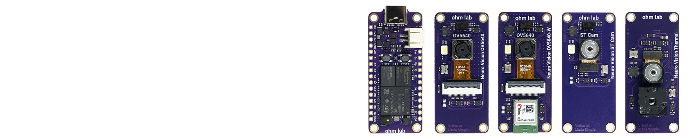
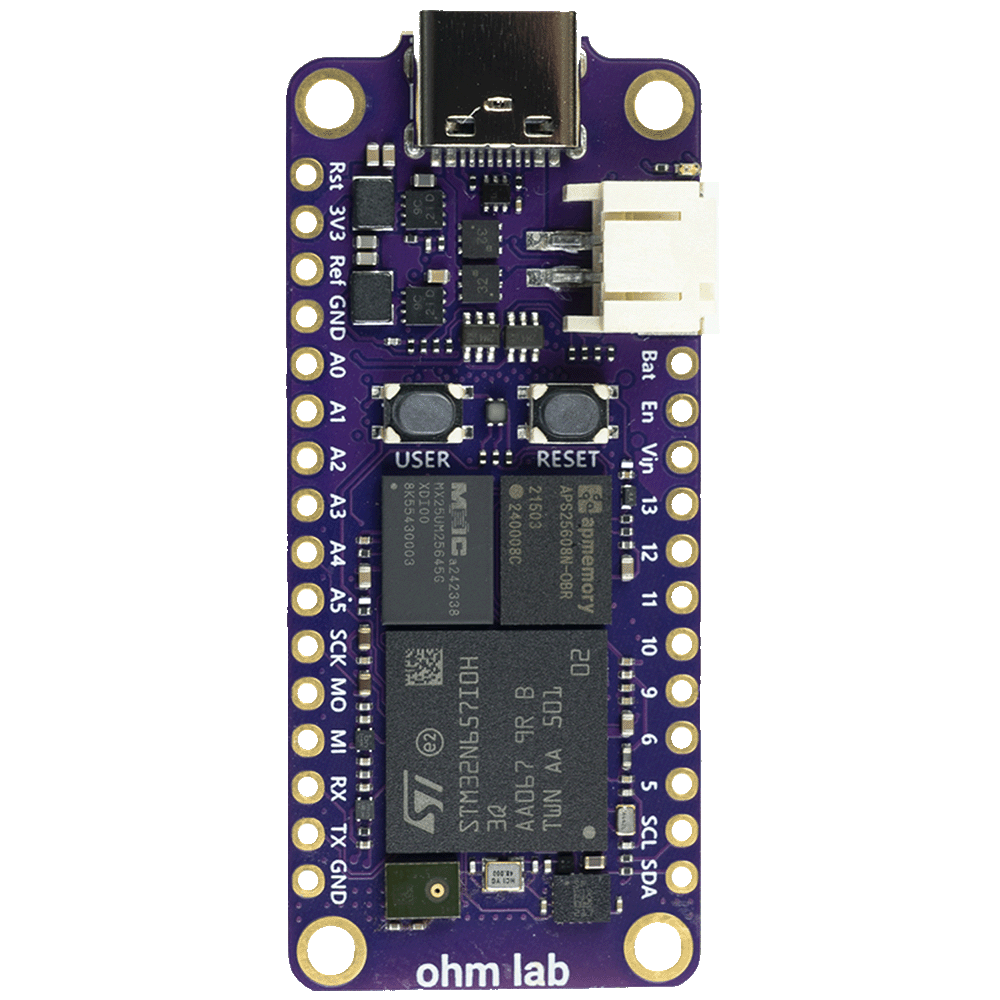
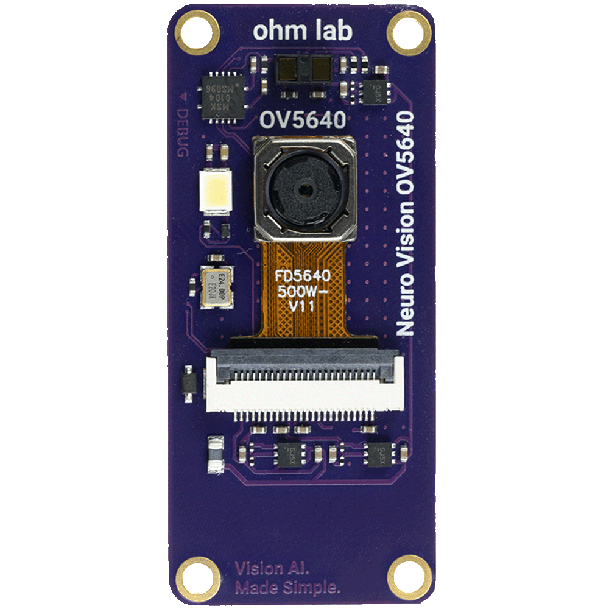
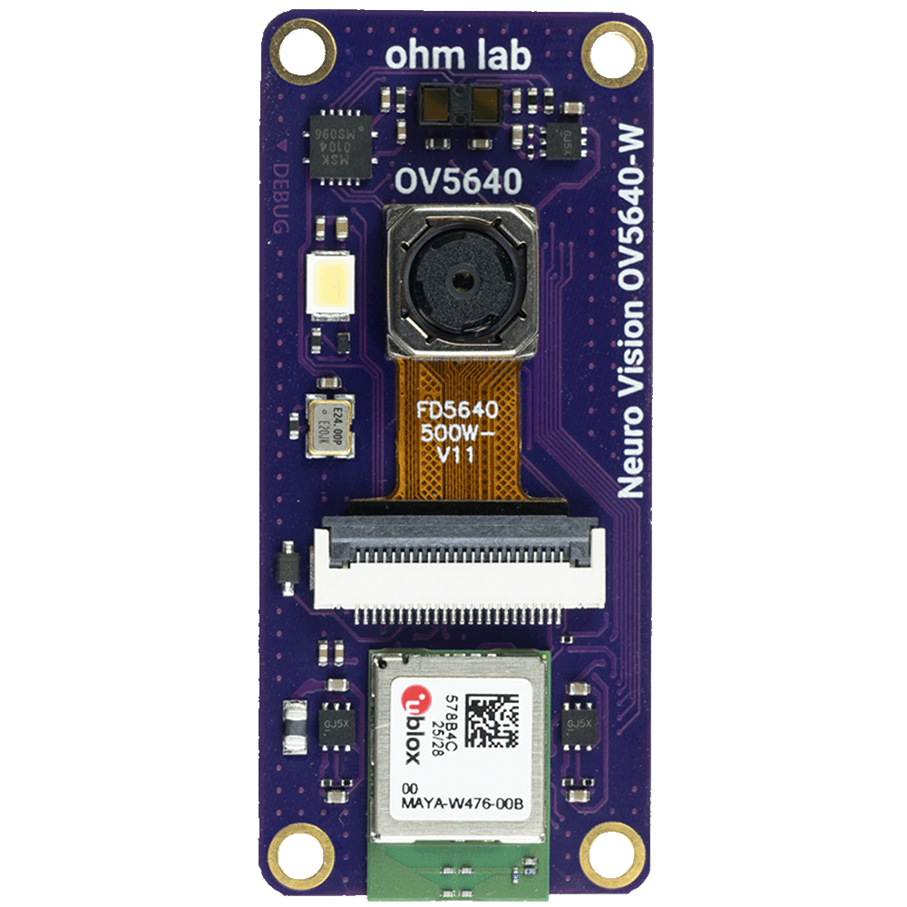
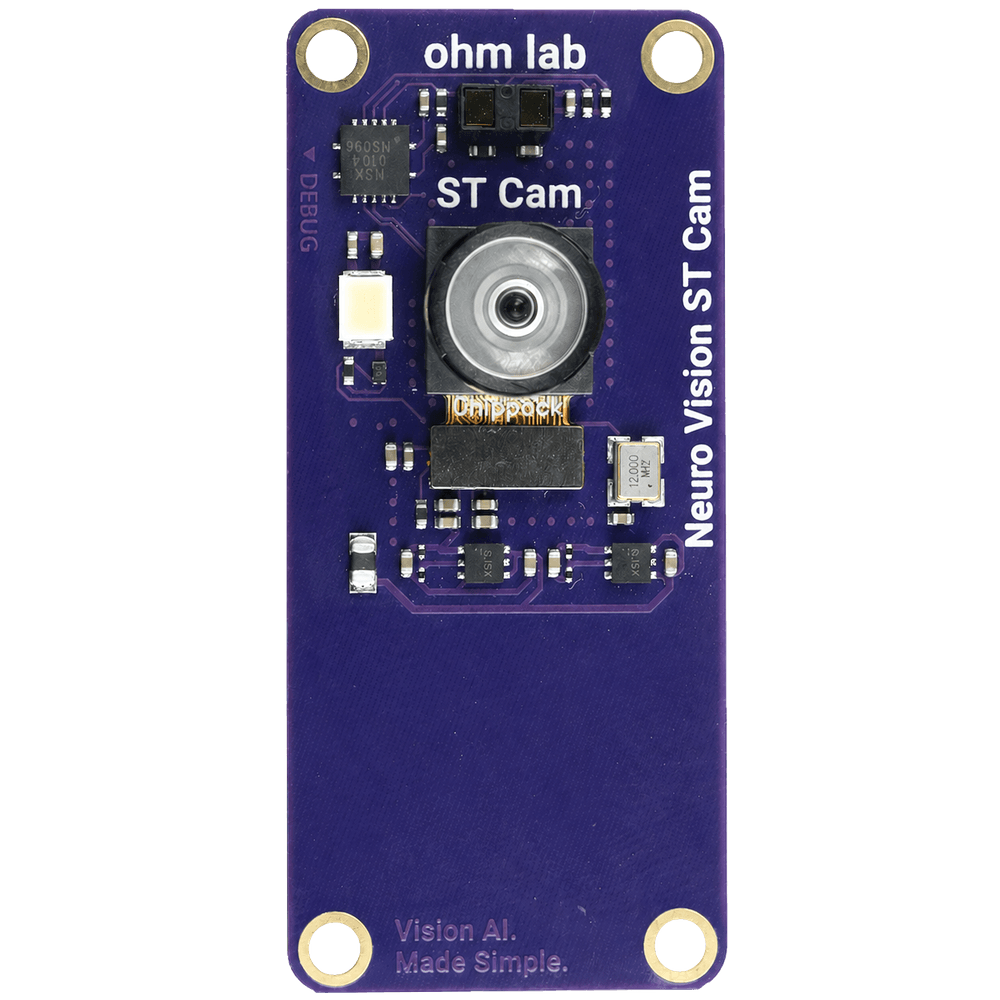
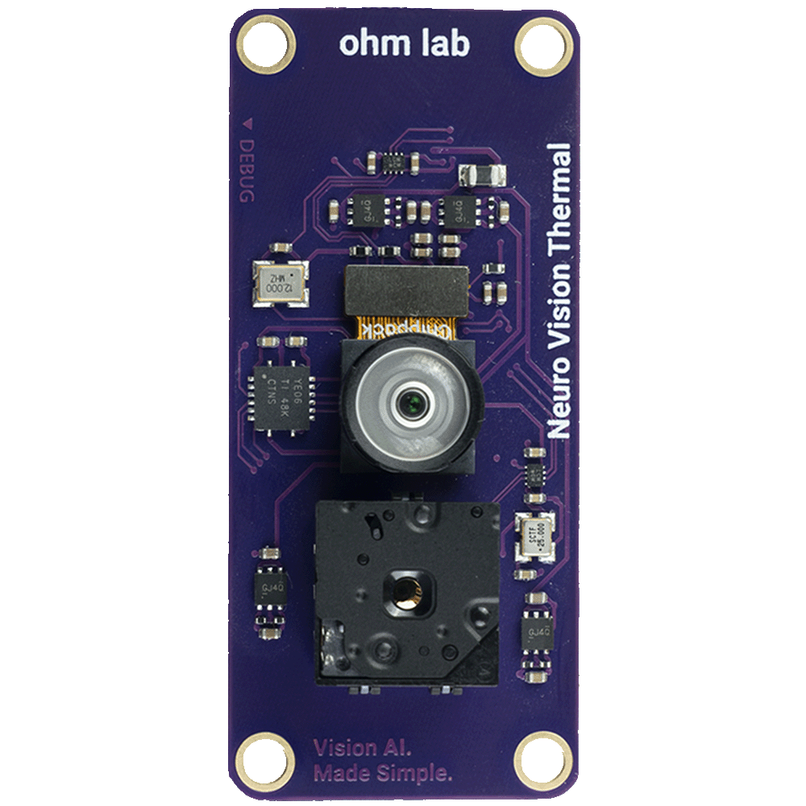

<p align="center">
  
</p>

<p align="center">
  Open hardware documentation, schematics, mechanical files, and product resources for the<br>
  <strong>OhmLab Neuro N6</strong> and <strong>Neuro Vision</strong> ecosystem.
</p>

<p align="center">
  <a href="https://ohmlab.co.uk"><strong>ohmlab.co.uk</strong></a>
  &nbsp;&bull;&nbsp;
  Estimated shipping: <strong>late October / early November</strong>
</p>

---

## Hardware status

All boards listed below are currently in production and have not yet shipped. Availability is planned for **late October / early November** from [ohmlab.co.uk](https://ohmlab.co.uk).

| Product | Part number | Revision | Production | Schematic | Datasheet | Shipping |
|:--|:--:|:--:|:--:|:--:|:--:|:--:|
| **Neuro N6** | `OL-DEV-N6-001` | **Rev C** | 🟢 In production | [Available](schematics/neuro-n6/Neuro-N6-Schematic-Rev-C.pdf) | No current datasheet ([legacy α.01](legacy/Neuro-N6-Datasheet-Alpha-01.pdf)) | Not yet shipped |
| **Neuro Vision OV5640** | `OL-DEV-N6-002` | **Rev B** | 🟢 In production | [Available](schematics/neuro-vision-ov5640/Neuro-Vision-OV5640-Schematic-Rev-B.pdf) | Not available | Not yet shipped |
| **Neuro Vision OV5640-W** | `OL-DEV-N6-003` | **Rev B** | 🟢 In production | [Available](schematics/neuro-vision-ov5640-w/Neuro-Vision-OV5640-W-Schematic-Rev-B.pdf) | Not available | Not yet shipped |
| **Neuro Vision ST Cam** | `OL-DEV-N6-004` | **Rev B** | 🟢 In production | [Available](schematics/neuro-vision-st-cam/Neuro-Vision-ST-Cam-Schematic-Rev-B.pdf) | Not available | Not yet shipped |
| **Neuro Vision Thermal** | `OL-DEV-N6-005` | **Rev C** | 🟢 In production | [Available](schematics/neuro-vision-thermal/Neuro-Vision-Thermal-Schematic-Rev-C.pdf) | Not available | Not yet shipped |
| **Neuro Vision TFT** | `OL-DEV-N6-006` | **Rev A** | 🟢 In production | To be announced | Not available | Not yet shipped |
| **Neuro Vision TFT-W** | `OL-DEV-N6-007` | **Rev B** | 🟢 In production | To be announced | Not available | Not yet shipped |

> Shipping dates are estimates and may change as production progresses.

**New datasheets are coming soon.** The Neuro N6 alpha datasheet is retained for legacy reference only and may not describe the current Rev C hardware.

## Product family

<table>
  <tr>
    <td align="center" width="20%"><br><strong>Neuro N6</strong><br><sub>Rev C</sub></td>
    <td align="center" width="20%"><br><strong>OV5640</strong><br><sub>Rev B</sub></td>
    <td align="center" width="20%"><br><strong>OV5640-W</strong><br><sub>Rev B</sub></td>
    <td align="center" width="20%"><br><strong>ST Cam</strong><br><sub>Rev B</sub></td>
    <td align="center" width="20%"><br><strong>Thermal</strong><br><sub>Rev C</sub></td>
  </tr>
</table>

## Documentation

- **Datasheets:** no current datasheets are available; new datasheets are coming soon
- **[3D-printed case](3d-printed-case/):** upper and lower enclosure STL files
- **[Schematics index](schematics/README.md):** released schematics and revision notes
- **[Legacy Neuro N6 alpha datasheet](legacy/Neuro-N6-Datasheet-Alpha-01.pdf):** superseded documentation retained for reference

## Repository contents

```text
.
├── assets/
│   ├── boards/                  Product imagery
│   └── branding/                OhmLab branding and repository header
├── 3d-printed-case/
│   ├── Neuro-N6-Lower-Case.stl
│   └── Neuro-N6-Upper-Case.stl
├── legacy/
│   └── Neuro-N6-Datasheet-Alpha-01.pdf
├── schematics/
│   ├── neuro-n6/
│   │   ├── Neuro-N6-Schematic-Rev-C.pdf
│   │   └── archive/             Earlier Neuro N6 schematic revisions
│   ├── neuro-vision-ov5640/     OV5640 schematic
│   ├── neuro-vision-ov5640-w/   OV5640-W schematic
│   ├── neuro-vision-st-cam/     ST Cam schematic
│   └── neuro-vision-thermal/    Thermal schematic
└── README.md
```

## Revision policy

Hardware revision and document revision are tracked independently. Always confirm that a schematic matches the revision printed on your PCB before using it for assembly, debugging, or repair. Superseded documents remain available under an `archive` directory and are clearly labelled.

## Availability

Boards will be available directly from **[OhmLab](https://ohmlab.co.uk)**. Watch this repository for schematic releases and documentation updates as production moves toward shipping.

---

<p align="center">
  <a href="https://ohmlab.co.uk"></a>
  <br><br>
  
</p>

